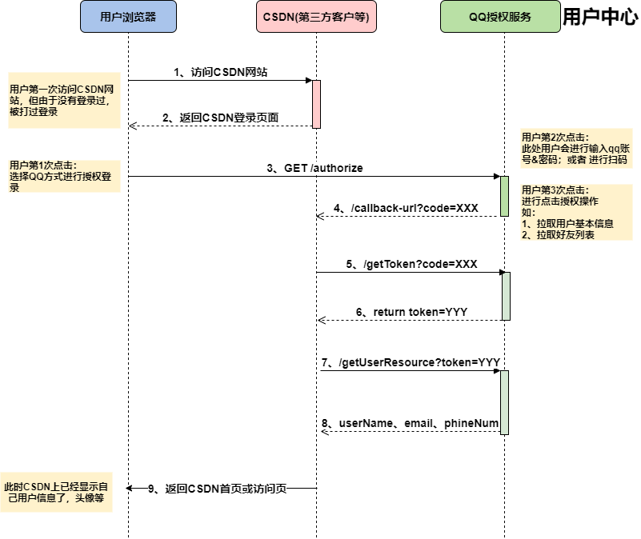

# liziyuan-Oauth2

#### 什么是OAuth2
OAuth（开放授权）是一个开放标准，允许用户授权第三方移动应用访问他们存储在另外的服务提供者上的信息，而不需要将用户名和密码提供给第三方移动应用或分享他们数据的所有内容，OAuth2.0是OAuth协议的延续版本，但不向后兼容OAuth 1.0即完全废止了OAuth1.0。  
  
##### 整体流程如下：


#### 项目介绍
自己手动实现的`单点登录（SSO）`和`OAuth2.0授权`的Demo项目。 

#### 技术依赖 ####

- `Spring Boot`：项目基础架构
- `thymeleaf`：用于构建测试页面模板
- `MyBatis`：用于访问`MySQL`数据库 

#### 环境依赖 ####

- `JDK8+`
- `MySQL5.7+`
- `Redis`

#### 二个子项目说明 ####

- `authorize-center-server`：`OAuth2.0授权`服务端项目，用于提供`OAuth2.0授权`接口，以及用于提供`单点登录（SSO）`服务
- `third-party-client`：用于测试`OAuth2.0授权`的第三方客户端项目

------

#### authorize-center-server项目 端口：7000 ####

##### 用户注册相关接口： #####

（1）用户注册：

**接口地址**：`http://127.0.0.1:7000/register`

**请求header**：`Content-Type: application/json;charset=UTF-8`

**请求body**：

```json
{
  "username":"zqz",
  "password":"123456",
  "mobile":"12306",
  "email":"admin@zifangsky.cn"
}
```

（2）登录地址：`http://127.0.0.1:7000/login`

（3）注销地址：`http://127.0.0.1:7000/logout`

（4）用户首页：`http://127.0.0.1:7000/user/userIndex`


##### OAuth2.0授权相关接口： #####

（1）客户端注册接口：

**接口地址**：`http://127.0.0.1:7000/oauth2.0/clientRegister`

**请求header**：`Content-Type: application/json;charset=UTF-8`

**请求body**：

```json
{
  "clientName":"CSDN-客户端",
  "redirectUri":"http://localhost:7080/login",
  "description":"这是一个测试客户端服务"
}
```
**返回结果**：
```json
{
    "id": null,
    "clientId": "6svX5bIrqtJtsFAEZgzQojeO",
    "clientName": "CSDN-客户端",
    "clientSecret": "RzQ3irOimLICL9fJ2rrDYayuOlEueWhm",
    "redirectUri": "https://www.csdn.net/",
    "description": "码农聚集地啊",
    "createUser": 9,
    "createTime": "2022-06-24T16:21:12.125+0000",
    "updateUser": 9,
    "updateTime": "2022-06-24T16:21:12.125+0000",
    "status": 1
}
```

（2）授权页面：`http://127.0.0.1:7000/oauth2.0/authorizePage?redirectUri=http%3A%2F%2F127.0.0.1%3A7000%2Foauth2.0%2Fauthorize%3Fclient_id%3Dx3qwrgrO1wYdz72joZ8YyIuD%26scope%3Dbasic%26response_type%3Dcode%26state%3DAB1357%26redirect_uri%3Dhttp%3A%2F%2F127.0.0.1%3A7000%2Fuser%2FuserIndex&client_id=x3qwrgrO1wYdz72joZ8YyIuD&scope=basic`

（3）获取Authorization Code：

**接口地址：**`http://127.0.0.1:7000/oauth2.0/authorize?client_id=6svX5bIrqtJtsFAEZgzQojeO&scope=basic&response_type=code&state=AB1357&redirect_uri=http://192.168.197.130:7080/login`

（4）通过Authorization Code获取Access Token：

**接口地址**：`http://127.0.0.1:7000/oauth2.0/token?grant_type=authorization_code&code=82ce2bf34f5028d7e8a517ef381f5c87f0139b26&client_id=6svX5bIrqtJtsFAEZgzQojeO&client_secret=tur2rlFfywR9OOP3fB5ZbsLTnNuNabI3&redirect_uri=http://192.168.197.130:7080/login`

**返回如下**：

```json
{
	"access_token": "1.6659c9d38f5943f97db334874e5229284cdd1523.2592000.1537600367",
	"refresh_token": "2.b19923a01cf35ccab48ddbd687750408bd1cb763.31536000.1566544316",
	"expires_in": 2592000,
	"scope": "basic"
}
```

（5）通过Refresh Token刷新Access Token：

**接口地址**：`http://127.0.0.1:7000/oauth2.0/refreshToken?refresh_token=2.5c58637a2d51e4470d3e1189978e94da8402785e.31536000.1566283826`

**返回如下**：

```json
{
	"access_token": "1.adebb0a4522d5dae9eaf94a5af4fec070c4f3dce.2592000.1537508734",
	"refresh_token": "2.5c58637a2d51e4470d3e1189978e94da8402785e.31536000.1566283826",
	"expires_in": 2592000,
	"scope": "basic"
}
```

（6）通过Access Token获取用户信息：

**接口地址**：`http://127.0.0.1:7000/api/users/getInfo?access_token=1.adebb0a4522d5dae9eaf94a5af4fec070c4f3dce.2592000.1537508734`

**返回如下**：

```json
{
	"mobile": "110",
	"id": 1,
	"email": "admin@zifangsky.cn",
	"username": "admin"
}
```

#### liziyuan-Oauth2项目   端口：7080 ####

> **特别提示**：在测试代码的时候，最好将授权服务端和客户端分别运行于两个不同服务器上面，不然域名都是localhost会被浏览器判断为同一个网站。 

（1）登录地址：`http://127.0.0.1:7080/login`

（2）用户首页：`http://127.0.0.1:7080/user/userIndex`

------


#### 详细的项目设计开发思路 ####
- [Oauth2详解-介绍](https://www.jianshu.com/p/84a4b4a1e833)
- [OAuth2.0协议入门（一）：OAuth2.0协议的基本概念以及使用授权码模式（authorization code）实现百度账号登录](https://www.zifangsky.cn/1309.html)
- [OAuth2.0协议入门（二）：OAuth2.0授权服务端从设计到实现](https://www.zifangsky.cn/1313.html)
- [OAuth2.0协议入门（三）：OAuth2.0授权与单点登录（SSO）的区别以及单点登录服务端从设计到实现](https://www.zifangsky.cn/1327.html)

